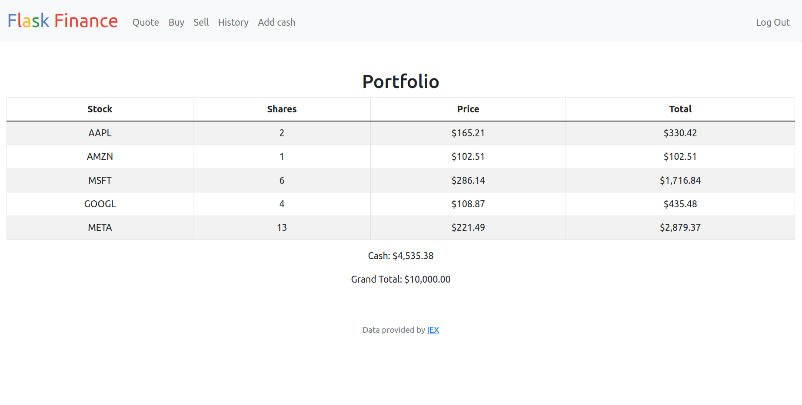

# Flask Finance



This is a Flask-based web application that allows users to quote, buy, and sell stocks. Users start with a fake cash balance of $10,000 and can use this to purchase stocks in real-time.

## Technologies used

- Flask
- SQLite
- HTML
- CSS
- Bootstrap

## Features

The Flask Finance app allows users to:

- Quote stock prices
- Buy and sell stocks
- View their portfolio and transaction history
- View real-time stock prices

## Installation and Setup

To use Flask Finance, follow these steps:

1. Clone the repository and navigate to the project directory:

```
git clone https://github.com/dascruz/flask-finance.git
cd flask-finance
```

2. Create and activate a virtual environment:

```
python3 -m venv venv
source venv/bin/activate
```

3. Install the required dependencies:

```
pip install -r requirements.txt
```

4. Set your IEX Cloud API key as an environment variable (you need to register to get an API key):

```
export API_KEY=YOUR_API_KEY_HERE
```

5. Rename or copy `finance_dev.db` to `finance.db`.

6. Start the Flask development server:

```
flask run
```

The Flask Finance app should now be running at http://localhost:5000/.

## Credits

This project was developed by Daniel Sánchez as a personal project. The IEX Cloud API was used to fetch real-time stock prices.

## License

This project is licensed under the [MIT License](https://opensource.org/license/mit/). Feel free to use, modify, and distribute this code for any purpose.
